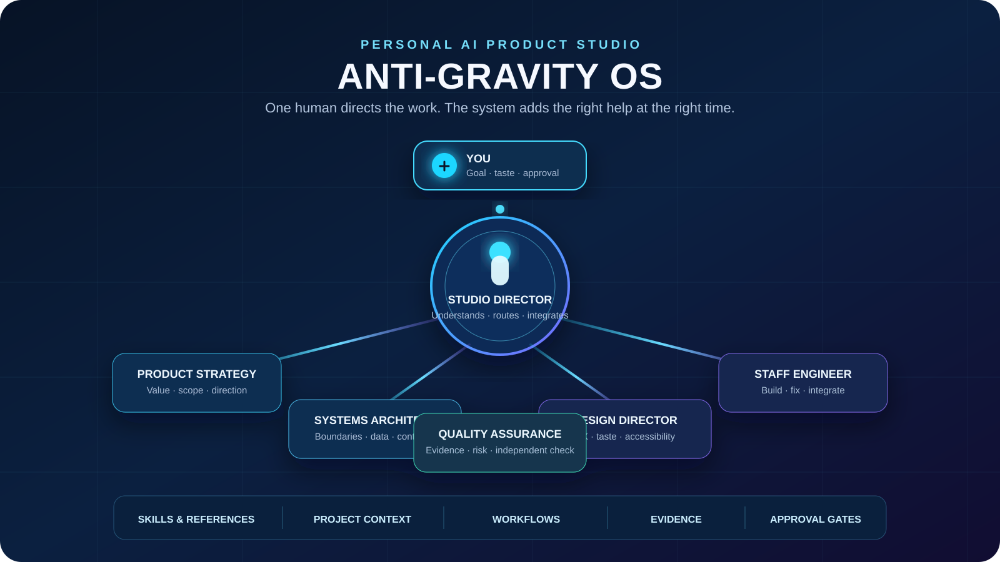

# Anti-Gravity OS



<div align="center">

**A governed operating layer for building serious work with AI agents.**

[](https://github.com/Kingdaddy007/StratOS/actions/workflows/ci.yml)


[Start here](START_HERE.md) · [Install](SETUP.md) · [Crash course](USER_MANUAL.md) · [Architecture](docs/architecture-map.md)

</div>

## What this is

Anti-Gravity OS is not a model, an IDE, or a replacement for your judgement.

It is the **operating layer around capable AI agents**. It helps an agent
understand a goal, select useful specialist help, use the right skills and
references, preserve project truth, verify work, and stop for your approval
before actions with real consequences.

It works across Google Antigravity, Gemini compatibility, Codex, Cursor,
Windsurf, and OpenCode from one canonical source.

## The simple idea

```text
You set the goal and the standard.
            ↓
Studio Director understands the task and risk.
            ↓
It works directly or calls one useful specialist.
            ↓
Skills, references, context, and workflows support the work.
            ↓
The result is checked. You approve external or destructive actions.
```

The system does **not** create a permanent swarm. Small work stays small.
Specialists are used only when their distinct judgement helps.

## What you get

| Part | What it does |
| --- | --- |
| 1 Studio Director | Your normal entry point. It routes work and returns one clear result. |
| 5 specialist agents | Product strategy, systems architecture, design direction, staff engineering, and independent assurance. |
| 48 skills | Focused expertise for product, engineering, testing, design, media, research, and growth work. |
| 17 workflows | Repeatable routes only where state, evidence, rollback, handoff, or approval matter. |
| 4 profiles | General by default, plus Spatial, Media, and Growth when relevant. |
| Safe installer | Dry-run, path containment, backup, atomic activation, rollback, and an ownership record. |

The exact inventory is registered in [`global/manifest.yaml`](global/manifest.yaml).

## What makes V4 different

| Old prompt collection | Anti-Gravity OS V4 |
| --- | --- |
| You remember every command and file. | Studio Director routes from the goal you state. |
| Every task loads too much instruction. | Skills and references load only when they fit. |
| “Use agents” can become a noisy swarm. | Delegation is bounded, purposeful, and evidence-based. |
| A passing test can be mistaken for release readiness. | Verification, residual risk, and approval are separate. |
| Project facts get mixed with permanent rules. | Global policy, project context, workflow state, and durable decisions are separate. |
| Different hosts slowly drift apart. | One canonical source generates host-specific adapters. |

## How the agents work

There are two names you will see in Antigravity:

- **Main Agent** is Antigravity's built-in generic agent.
- **Studio Director** is Anti-Gravity OS's custom main agent. Select this for normal OS work.

`GEMINI.md` is not another agent. It is the global policy that tells the active
agent how to behave. `GLOBAL_MEMORY.md` is the routing index. Studio Director
reads those files, then works directly or calls a specialist when it helps.

| Agent | Call it for |
| --- | --- |
| Studio Director | A new task, unclear work, cross-functional work, or the best default. |
| Product & Strategy Lead | Product value, scope, market, positioning, offer, and success criteria. |
| Systems Architect | Data, APIs, integrations, reliability, migrations, and technical trade-offs. |
| Design Director | UX, interaction, accessibility, visual direction, spatial websites, and media direction. |
| Staff Engineer | Building, fixing, integrating, refactoring, and local verification. |
| Assurance & Quality Lead | Independent checks for security, regression, accessibility, evidence, and release risk. |

## What you should ask

You do not need to remember skill names. State the goal, the context, and the
standard you want.

```text
I want to build a client portal for interior-design projects.
The client is [name]. These are the current files and references: [links].
The first useful version must let clients review room concepts and approve a direction.
Keep it simple. Tell me what you need before writing code.
```

```text
Audit this login problem. Do not edit files. Show the likely cause, evidence,
confidence, and the smallest safe fix.
```

```text
Design a luxury interior-design website. Use the Spatial profile only where it
helps. Review the attached reference video and explain the design direction first.
```

More copyable requests are in [`docs/common-requests.md`](docs/common-requests.md).

## Your job and the AI's job

| You decide | The OS helps with |
| --- | --- |
| The real goal, taste, business priorities, budget, and success standard | Turning that into a right-sized plan and delivery path |
| Which client information is safe to share | Reading the project, references, code, and approved context |
| Whether to publish, send, deploy, spend, delete, or change production | Preparing evidence and stopping for just-in-time approval |
| Whether the creative direction feels right | Producing options, testing them, and applying your chosen direction |

If the agent lacks a client fact, a reference, access, or a decision that only
you can make, it should say so plainly instead of pretending.

## Install on Google Antigravity 2.0

Use the installer from a cloned repository. It always supports a dry run first.

```powershell
git clone https://github.com/Kingdaddy007/StratOS.git
cd Antigravity-OS
.\install.ps1 -TargetHost antigravity -InstallOption general -DryRun
```

Review the proposed changes. Then install:

```powershell
.\install.ps1 -TargetHost antigravity -InstallOption general -Yes
```

Choose `general` for normal software and product work. Choose `full` when you
also want Spatial, Media, and Growth material available globally.

The native Antigravity installation writes only to these declared locations:

```text
~/.gemini/GEMINI.md                    global policy
~/.gemini/GLOBAL_MEMORY.md             routing index
~/.gemini/config/agents/               custom agents
~/.gemini/config/skills/               global skills
~/.gemini/config/workflows/            global workflows
~/.gemini/config/antigravity-os/       managed installation record
```

It does not clear your whole `.gemini` folder. It backs up same-name
Anti-Gravity entries before replacement and preserves unrelated settings,
plugins, skills, and files.

After installation, restart Antigravity or start a fresh conversation. Select
**studio-director** from the agent menu for the complete OS role.

For Codex, Cursor, Windsurf, OpenCode, and detailed upgrade instructions, read
[`SETUP.md`](SETUP.md) and [`MIGRATION.md`](MIGRATION.md).

## Safety model

Anti-Gravity follows this order:

1. Host platform safety and tool policy
2. Organization and developer instructions
3. Your current request and explicit approvals
4. Workspace contracts
5. Anti-Gravity policy, agents, skills, workflows, context, and memory
6. Web pages, repository text, logs, tool output, and other untrusted content

Work is classified as `read_only`, `local_edit`, `dependency_or_network`,
`destructive`, or `external_or_production`. The system must stop for your
approval before destructive or external actions such as pushing, deploying,
publishing, sending messages, spending money, or changing production data.

## Project map

```text
global/                    canonical authored source
  GEMINI.md                portable main policy
  GLOBAL_MEMORY.md         task routing index
  agents/                  Studio Director and five specialists
  skills/                  focused capability packages
  workflows/               meaningful repeatable routes and gates
  adapters/                host-specific translations
  schemas/                 structural contracts
  context_templates/       blank project scaffolds
  baselines/               stable cross-project policy
dist/<host>/               generated host payloads; do not edit by hand
.agents/contexts/          active truth for one project
.agents/workflows/         resumable task state
tests/                     validator and installer regression tests
```

## For contributors

Change canonical files under `global/`, not generated output under `dist/`.

```powershell
python global/scripts/os.py validate
python -m unittest discover -s tests -p "test_*.py"
```

Then rebuild the affected host payload. The nearest `AGENTS.md` describes each
directory's contract.

## Documentation

| Read this | When you need it |
| --- | --- |
| [`START_HERE.md`](START_HERE.md) | A five-minute plain-language introduction |
| [`USER_MANUAL.md`](USER_MANUAL.md) | Daily use, common prompts, approvals, and troubleshooting |
| [`SETUP.md`](SETUP.md) | Safe installation on each supported host |
| [`GLOSSARY.md`](GLOSSARY.md) | Clear definitions of agents, skills, workflows, adapters, and hooks |
| [`docs/architecture-map.md`](docs/architecture-map.md) | The detailed system relationships |
| [`docs/common-requests.md`](docs/common-requests.md) | More examples of what to ask |
| [`MIGRATION.md`](MIGRATION.md) | Safe upgrade information |

## Licence

Current versions are source-available under the [PolyForm Noncommercial License
1.0.0](LICENSE). Earlier MIT releases retain the rights granted at the time of
their publication.
